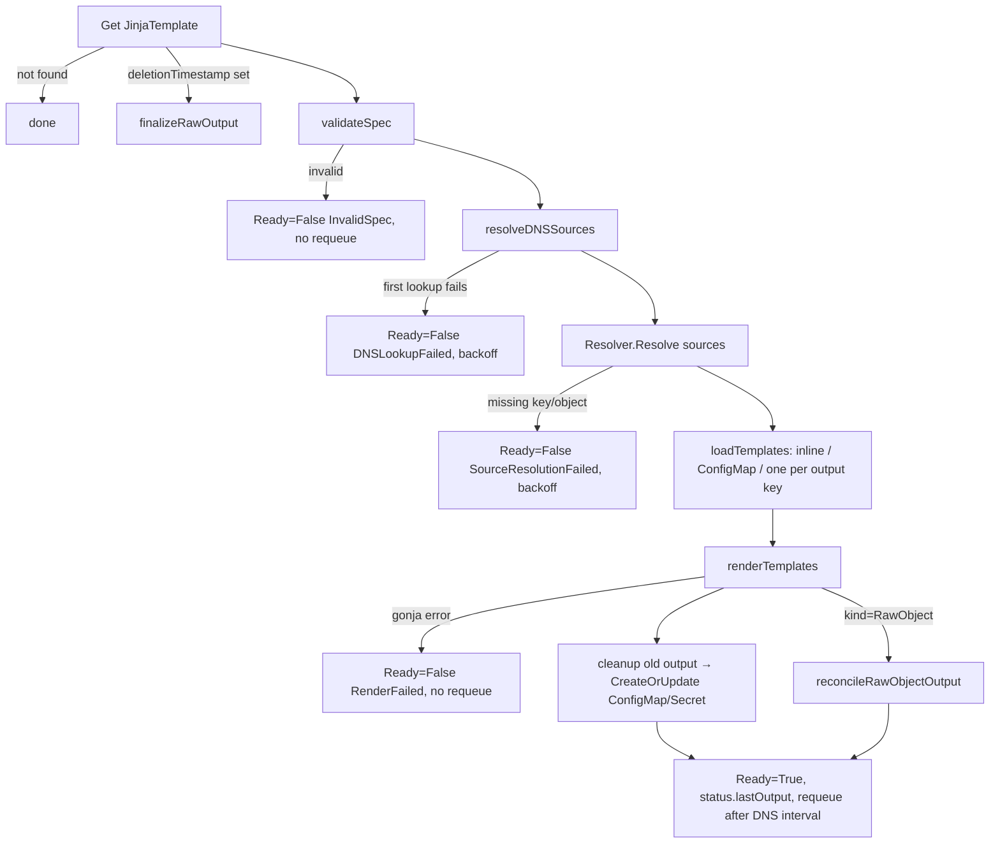

# Developer Guide

Contributor-facing documentation for the Jinja Template Operator. User-facing usage lives in [README.md](README.md), the security design in [SECURITY_ARCHITECTURE.md](SECURITY_ARCHITECTURE.md).

## Repository layout

```
api/v1/
  jinjatemplate_types.go        # CRD types: spec, status, kubebuilder markers
  groupversion_info.go          # SchemeBuilder for jto.gtrfc.com/v1
  zz_generated.deepcopy.go      # controller-gen output (do not edit by hand)
cmd/
  main.go                       # flags, manager setup, reconciler wiring
internal/
  config/config.go              # OperatorConfig: global defaults (owner reference)
  controller/
    jinjatemplate_controller.go # Reconcile loop, validation, ConfigMap/Secret output, watches
    rawobject.go                # RawObject path: parse, impersonate, SSA apply, finalizer
    dns.go                      # DNS source resolution, grace periods, requeue timing
  sources/
    resolver.go                 # ConfigMap/Secret resolution → template context
    dns.go                      # miekg/dns lookuper, CNAME chains, record merging
  template/renderer.go          # Gonja compile + execute
config/
  crd/bases/                    # generated CRD (single source of truth)
  rbac/                         # plain-YAML RBAC mirror of the chart's ClusterRole
deploy/helm/jinja-template-operator/
  Chart.yaml, values.yaml
  templates/                    # deployment, SA, (aggregate) ClusterRoles, CRD, optional VAP
examples/
  calico-globalnetworkpolicy/   # end-to-end RawObject example incl. RBAC
test/
  integration/                  # envtest suite, build tag `integration`
  e2e/                          # Kind + Helm suite, build tag `e2e`
.github/workflows/
  release.yml                   # "Test and Release": CI on push/PR + semantic-release
  build.yml                     # "Release Docker & Helm": image + chart on GitHub release
  renovate.yml                  # dependency updates
PLAN.md                         # design record of the RawObject impersonation redesign
```

## Package responsibilities

### `api/v1`

| File | Responsibility |
|------|----------------|
| `jinjatemplate_types.go` | `JinjaTemplateSpec`/`Status`, `Source`, `Output`, `OutputKey`, `OutputRef`, `DNSSource*`. Validation that the API server can express (enums, minimums, defaults) lives here as kubebuilder markers; everything cross-field is validated in the controller |
| `groupversion_info.go` | `GroupVersion` `jto.gtrfc.com/v1`, `SchemeBuilder`, `AddToScheme` |
| `zz_generated.deepcopy.go` | Generated deep-copy methods |

### `internal/controller`

| File | Responsibility |
|------|----------------|
| `jinjatemplate_controller.go` | `Reconcile` entry point, `validateSpec`, template loading (inline / ConfigMap / multi-key), rendering, ConfigMap+Secret output via `CreateOrUpdate`, old-output cleanup, conditions/events, watch mapping for ConfigMaps and Secrets |
| `rawobject.go` | `RawObject` spec rules, single-document manifest parsing, namespace/scope rules, impersonated client construction, fail-closed ServiceAccount check, server-side apply, finalizer lifecycle, deletion path |
| `dns.go` | Per-source lookups, merge with `status.dnsSources`, `DNSHealthy` condition, requeue interval from TTL / refresh interval / grace expiry |

### `internal/sources`

| File | Responsibility |
|------|----------------|
| `resolver.go` | Direct (`name` + `key`) and label-selector resolution for ConfigMaps and Secrets; converts to the template context (`string` or `[]{name, data}`) |
| `dns.go` | `DNSLookuper` interface + `MiekgLookuper` (CNAME chains, TCP retry on truncation, resolver discovery), `MergeDNSRecords`, `RecordValues` |

### `internal/template`, `internal/config`

| File | Responsibility |
|------|----------------|
| `template/renderer.go` | Thin Gonja wrapper: `Render` (compile + execute), `Validate` (compile only). The package intentionally shadows the stdlib name `template`; the layout is fixed by the project spec and `revive`'s package-name check is disabled for it |
| `config/config.go` | `OperatorConfig.DefaultOwnerReference` and `ShouldSetOwnerReference(crOverride)` — the only place the CR override / global default precedence is decided |

## Core flow: reconcile



Design notes behind the non-obvious parts:

- **Status is written on every path.** `Reconcile` calls the inner `reconcile` and then always issues a `Status().Update`, so conditions survive error returns. A conflict requeues immediately instead of failing the reconcile.
- **DNS first.** DNS sources are stateful (grace periods, stale-on-error) and determine the requeue interval, so they resolve before everything else; their results are handed to `Resolver.Resolve` as a plain map instead of being resolved inside the resolver.
- **Requeue vs. terminal.** Errors that a user must fix in the CR (`InvalidSpec`, `RenderFailed`, `RawObjectInvalid`) return `nil` — retrying cannot help and would burn backoff. Errors that outside changes can fix (missing source, missing ServiceAccount, RBAC denial) are returned so controller-runtime retries with backoff. This matters because ServiceAccounts, RBAC and RawObject targets are not watched.
- **Multi-key rendering** produces `map[key]value` and replaces `Data` wholesale, so keys removed from `output.keys` disappear. Multi-key values are `TrimSpace`d, single-key values are not.
- **Watches are name/selector-matched in code**, not indexed: a ConfigMap or Secret event lists the `JinjaTemplate`s of that namespace and checks source references, `templateFrom` references and the CR's own output name. Fine at the expected scale; if it becomes hot, add a field index instead of broadening the watch.

## Core flow: RawObject apply

1. Parse the rendered string as **exactly one** YAML document (`utilyaml.NewYAMLReader` — `sigs.k8s.io/yaml` alone would silently drop everything after the first `---`), then `UnmarshalStrict`. Require `apiVersion`, `kind`, `metadata.name`; reject `generateName`.
2. **Fail-closed ServiceAccount check** via `APIReader` (uncached). A cached read would need cluster-wide `list`/`watch` on ServiceAccounts and could serve a deleted SA. RBAC bindings match the bare name string, so a deleted SA would otherwise keep working — the check is what makes deletion act as revocation.
3. Determine scope through the RESTMapper. Namespaced kinds are pinned to the CR's namespace; cluster-scoped kinds must not set one.
4. **Finalizer before apply.** For cluster-scoped outputs the finalizer `jto.gtrfc.com/raw-output-cleanup` is added *before* the object exists, otherwise a CR deletion racing the apply orphans the object.
5. Clean up the previous output if GVK/name/namespace changed — under the identity in `status.lastOutput.serviceAccountName`, not the current spec value. A ServiceAccount change alone re-applies under the new identity rather than delete-and-recreate.
6. Apply with server-side apply, `ForceOwnership`, field manager `jinja-template-operator`, using a per-reconcile impersonating client (`rest.CopyConfig` + `Impersonate.UserName`). Discovery and REST mapping stay on the operator's own identity; only object access is impersonated. The client is not cached — client-go pools the transport.

`RawClientFactory` and `DNSLookuper` are injection points on the reconciler: unit tests replace them because a fake client cannot simulate impersonation and real DNS is not available in tests.

## Extension checklists

### Add a new source type

1. Add the type to [api/v1/jinjatemplate_types.go](api/v1/jinjatemplate_types.go) as a new pointer field on `Source`, with kubebuilder markers for anything the API server can validate.
2. Regenerate CRD + deepcopy (see [Code generation](#code-generation)), then `make sync-helm-crd`.
3. Extend `validateSources` in [internal/controller/jinjatemplate_controller.go](internal/controller/jinjatemplate_controller.go) — the "exactly one of" counter must include the new field.
4. Implement resolution in [internal/sources/resolver.go](internal/sources/resolver.go) (`resolveSource` switch) — or, if the source is *stateful* (needs status, grace periods, timed refresh), model it like DNS: resolve in the controller and pass values into `Resolve`.
5. Decide how changes trigger a reconcile: a watched Kubernetes object (extend `sourceConfigsMatch` and the watches in `SetupWithManager`) or a timed requeue (extend the requeue calculation).
6. Tests: resolver unit test, controller test, integration test in [test/integration/](test/integration/).
7. Document: README field reference, template-context table, naming conventions if new status fields appear.

### Add a new output kind

1. Add the value to the `Kind` enum marker in `api/v1`, regenerate, `make sync-helm-crd`.
2. Extend the `switch` in `validateSpec` with the kind's field rules (which of `name`/`key`/`keys`/`serviceAccountName` are required or forbidden).
3. Branch in `reconcile` before the ConfigMap/Secret path, mirroring `reconcileRawObjectOutput`.
4. Handle cleanup: `deleteLastOutput` dispatches on `OutputRef.APIVersion` — make sure your kind is distinguishable there.
5. Decide the garbage-collection story (OwnerReference vs. finalizer) and wire `reconcileRawOutputFinalizer` accordingly.
6. Tests in `internal/controller` and `test/integration`; extend `test/e2e` if the kind needs a real API server.

### Add a new condition or reason

1. Add the constant next to the existing ones in `internal/controller` (`ConditionReady`, `ReasonRenderFailed`, …).
2. Set it via `setCondition` / `setConditionOfType`; remove transient conditions with `removeCondition` when their subsystem is no longer configured (as `DNSHealthy` does).
3. Always pair a `False` condition with a `Recorder.Eventf` Warning — `kubectl describe` is the primary debugging surface.
4. Document it in the README status reference table, including whether it requeues.

### Add a Helm value

1. Add it to [values.yaml](deploy/helm/jinja-template-operator/values.yaml) with a comment explaining the default.
2. Wire it into the template that consumes it — a value that no template reads is worse than no value (`logLevel` is currently in that state).
3. If it changes operator behavior, add the corresponding flag in [cmd/main.go](cmd/main.go) and pass it in [deployment.yaml](deploy/helm/jinja-template-operator/templates/deployment.yaml).
4. Document it in the README Helm values table with its real default.

## Build, test and lint matrix

| Command | Scope | Notes |
|---------|-------|-------|
| `make build` | `fmt` + `vet` + build `bin/manager` | |
| `make run` | Local run against current kubeconfig | `--zap-log-level=debug` |
| `make fmt` / `make vet` | `gofmt -s -w .` / `go vet ./...` | |
| `make lint` | vet + gofmt check + golangci-lint | Config: [.golangci.yml](.golangci.yml) (`revive`, `goconst`, `misspell`, `prealloc`, `unconvert`, `unparam`; `gofmt`/`goimports` as formatters) |
| `make cyclo` | Cyclomatic complexity gate | Threshold 15, `_test.go` excluded; `make cyclo-report` for the top-20 list |
| `make test-unit` | `go test -short ./...` | Covers the untagged packages only — `test/integration` and `test/e2e` are excluded by build tags. `KUBEBUILDER_ASSETS` is exported and `-short` passed, but no test currently reads `testing.Short()` |
| `make test-unit-coverage` | Unit tests → `coverage/unit.out` | Used by CI |
| `make test-integration` | Build tag `integration`, envtest | `test/integration/`, timeout 60m |
| `make test-integration-coverage` | Same + `coverage/integration.out` | `-coverpkg=./...` |
| `make test-e2e` | Build tag `e2e` | Expects an operator already installed in a running cluster |
| `make e2e-local` | Kind create → image load → Helm install → E2E → cluster delete | The full local loop |
| `make test` / `make test-coverage` | All tests + `cover.out` / HTML report | |
| `make coverage-merge` / `coverage-json` | Merge unit+integration, write the shields.io badge JSON | |
| `make gosec` / `make vuln` | gosec scan / govulncheck | |
| `make docker-build` / `docker-push` / `docker-buildx` | Image via [Containerfile](Containerfile) | `IMG` defaults to `guidedtraffic/jinja-template-operator:latest` |
| `make kind-create` / `kind-load` / `kind-delete` | Kind cluster `jinja-operator-test` | |

Toolchain: Go per [go.mod](go.mod) (`1.26.5`, matching `GO_VERSION` in CI), envtest Kubernetes `1.29.0`, golangci-lint `v2.9.0`, kustomize `v5.3.0`, gocyclo `v0.6.0`. Tools install into `bin/` on demand.

**Known gaps in the Makefile** (documented rather than implied to work):

- `make install`, `uninstall`, `deploy`, `undeploy` run `kustomize build config/rbac` / `config/default` and `cd config/manager`, but the repo has no `kustomization.yaml` and no `config/manager` or `config/default` directory. These targets fail; deployment happens through the Helm chart.
- There is no `manifests`/`generate` target. See below.

### Code generation

The CRD ([config/crd/bases/jto.gtrfc.com_jinjatemplates.yaml](config/crd/bases/jto.gtrfc.com_jinjatemplates.yaml), annotated `controller-gen v0.14.0`) and `zz_generated.deepcopy.go` are controller-gen output, but **no Makefile target regenerates them** — run controller-gen manually after changing `api/v1`:

```bash
go run sigs.k8s.io/controller-tools/cmd/controller-gen@v0.14.0 \
  object paths=./api/... \
  crd output:crd:artifacts:config=config/crd/bases
make sync-helm-crd     # copies the CRD into the chart and injects the Helm labels
```

`config/crd/bases/` is the single source of truth; [deploy/helm/.../templates/crd.yaml](deploy/helm/jinja-template-operator/templates/crd.yaml) is generated from it and must not be edited directly. The plain YAML under [config/rbac/](config/rbac/) mirrors the chart's ClusterRole for non-Helm installs and is maintained by hand — keep both in sync when permissions change.

## CI and release

`.github/workflows/release.yml` ("Test and Release") runs on push/PR to `main` on self-hosted runners:

| Job | Purpose |
|-----|---------|
| `linter` | `make lint` |
| `unit-tests` / `integration-tests` | Coverage profiles uploaded as artifacts |
| `e2e-tests` | Kind cluster in DinD, image built and imported via `ctr`, Helm install with [test/e2e/helm-values.yaml](test/e2e/helm-values.yaml), then `make test-e2e`. Contains explicit workarounds for DinD flakiness (inotify limits, kube-proxy iptables resync) |
| `gosec` / `govulncheck` | Security scan / vulnerability check |
| `cyclomatic-complexity` | `make cyclo` + step summary |
| `malware-scan` / `container-malware-scan` | ClamAV over the source tree; Trivy (`vuln,secret,misconfig`, CRITICAL/HIGH, fail on findings) over the built image |
| `coverage-report` | Merges profiles, writes `.github/badges/coverage.json`, comments the diff vs. `main` on PRs |
| `semantic-release` | Only on push to `main`, after all other jobs pass |

Releases follow [Conventional Commits](https://www.conventionalcommits.org/) via semantic-release ([.releaserc.json](.releaserc.json)): commit analysis → release notes → GitHub release → a `chore(release): x.y.z [skip ci]` commit carrying the updated coverage badge.

Publishing a GitHub release triggers `.github/workflows/build.yml` ("Release Docker & Helm"):

1. Multi-tag image build and push to Docker Hub with provenance, SBOM and Docker Scout scan.
2. Chart `version`/`appVersion` and `image.tag` are rewritten from the release tag, the chart is packaged and pushed to the `gh-pages` branch, which serves the Helm repo at `https://guided-traffic.github.io/jinja-template-operator/`.

Dependency updates come from Renovate ([renovate.json](renovate.json)); indirect Go module updates are deliberately not automated.

## Conventions

- **Language:** code, comments, commit messages and documentation are English.
- **Commits:** Conventional Commits — the release type is derived from them.
- **Comments explain *why*.** The interesting comments in this codebase (fail-closed SA check, finalizer ordering, requeue-vs-terminal) exist because the reasoning is not visible in the code.
- **Errors** are lower-case, wrapped with `%w`, and name the object they refer to (`namespace/name`).
- **Every user-visible failure sets a condition *and* emits an event.**
- **Imports** are grouped stdlib / third-party / local, with `goimports` local prefix `github.com/guided-traffic/jinja-template-operator`.
- **Tests** use `testify`; unit tests live next to their code, envtest suites under `test/integration` behind the `integration` build tag, cluster tests under `test/e2e` behind `e2e`.
- **Keep functions under complexity 15** — CI enforces it.
- **Documentation is part of the change:** touching behavior that README, DEVELOPER or SECURITY_ARCHITECTURE describe means updating those sections in the same commit.
