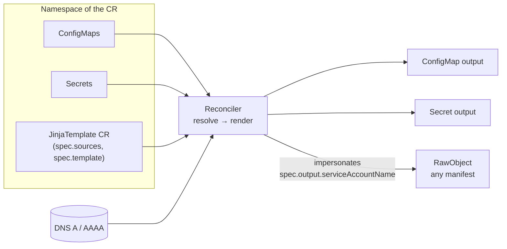

# Jinja Template Operator

[](https://github.com/guided-traffic/jinja-template-operator/actions)
[](https://github.com/guided-traffic/jinja-template-operator)
[](https://goreportcard.com/report/github.com/guided-traffic/jinja-template-operator)
[](LICENSE)

A Kubernetes operator that renders [Jinja-like templates](https://github.com/guided-traffic/gonja) into **ConfigMaps**, **Secrets** or **arbitrary Kubernetes manifests**. Template variables come from ConfigMaps, Secrets (by name or label selector) and DNS lookups in the same namespace; the operator re-renders automatically whenever a source changes. Raw manifest outputs are applied under a tenant ServiceAccount's identity, so authorization stays plain Kubernetes RBAC.



## ✨ Key Features

- 🎨 **Jinja-like templating** — [Gonja](https://github.com/guided-traffic/gonja) engine with filters, loops and conditionals
- 📦 **ConfigMap / Secret sources** — a single key by name, or a whole group via label selector
- 🌐 **DNS sources** — resolve `A`/`AAAA` records into a sorted IP list, with TTL-driven refresh, removal grace periods and stale-on-error behavior
- 🔄 **Reactive reconciliation** — source changes, deleted outputs and new label-selector matches all trigger a re-render
- 🗝️ **Multi-key output** — emit several independently rendered keys into one ConfigMap/Secret
- 📝 **Inline or external templates** — in the CR, or loaded from a ConfigMap key
- 🧱 **Raw object output** — render a complete manifest (e.g. a Calico `GlobalNetworkPolicy`) and apply it via server-side apply
- 🔐 **ServiceAccount impersonation** — raw outputs are applied and deleted as a tenant ServiceAccount; authorization is standard RBAC, auditable with `kubectl auth can-i --as=…`
- 🔗 **Configurable OwnerReference** — decide per CR (or globally) whether outputs are garbage-collected with the CR
- 🌍 **Cluster-scoped operator** — one instance watches all namespaces

## 📛 Naming conventions

Everything the operator generates deterministically.

### Generated output resources

| Item | Pattern | Notes |
|------|---------|-------|
| Output resource name | `spec.output.name`, else `metadata.name` of the CR | Not applicable to `RawObject` — the name comes from the rendered manifest |
| Output data key | `spec.output.key`, else `content` | Ignored when `spec.output.keys` is set |
| Output namespace | Always the CR's own namespace | Cross-namespace outputs are rejected |
| Secret type | `Opaque` | Fixed for `Secret` outputs |
| Label on outputs | `jto.gtrfc.com/managed-by: jinja-template-operator` | Set on ConfigMap, Secret and RawObject outputs |
| Label on outputs | `jto.gtrfc.com/jinja-template: <cr-name>` | References the owning CR |

### Operator-internal identifiers

| Item | Value | Notes |
|------|-------|-------|
| API group / version / kind | `jto.gtrfc.com/v1`, `JinjaTemplate` | Namespaced CR |
| Finalizer | `jto.gtrfc.com/raw-output-cleanup` | Only on CRs owning a cluster-scoped RawObject |
| Server-side apply field manager | `jinja-template-operator` | Used for RawObject applies |
| Impersonated identity | `system:serviceaccount:<cr-namespace>:<spec.output.serviceAccountName>` | Namespace is always the CR's own |
| Leader election Lease | `jinja-template-operator.jto.gtrfc.com` | In the operator's release namespace |
| Event reporting controller | `jinjatemplate-controller` | Appears in `kubectl describe` events |
| Condition types | `Ready`, `DNSHealthy` | `DNSHealthy` only exists while DNS sources are configured |

### Helm-generated resource names

`<fullname>` is the release name, or `<release>-jinja-template-operator` when the release name does not already contain the chart name (`fullnameOverride` wins).

| Resource | Name |
|----------|------|
| Deployment | `<fullname>` |
| ServiceAccount | `<fullname>` (override: `serviceAccount.name`) |
| ClusterRole | `<fullname>-manager-role` |
| ClusterRoleBinding | `<fullname>-manager-rolebinding` |
| Aggregate ClusterRoles | `<fullname>-aggregate-admin` / `-aggregate-edit` / `-aggregate-view` |
| ValidatingAdmissionPolicy (+ Binding) | `<fullname>-rawobject-author-check` |

## 📚 Documentation

| Document | Content |
|----------|---------|
| [DEVELOPER.md](DEVELOPER.md) | Repo layout, package responsibilities, reconcile pipeline, extension checklists, build/test matrix, CI/release |
| [SECURITY_ARCHITECTURE.md](SECURITY_ARCHITECTURE.md) | Trust boundaries, secret flow, impersonation model, privilege footprint, residual risks |
| [examples/calico-globalnetworkpolicy/](examples/calico-globalnetworkpolicy/) | End-to-end RawObject walkthrough including RBAC |
| [Full reference](#-full-reference) | Every `JinjaTemplate` field and Helm value |
| [Gonja](https://github.com/guided-traffic/gonja) | Template engine syntax (filters, loops, conditionals) |
| [Kubernetes: user impersonation](https://kubernetes.io/docs/reference/access-authn-authz/authentication/#user-impersonation) | Mechanism behind RawObject authorization |
| [Kubernetes: ValidatingAdmissionPolicy](https://kubernetes.io/docs/reference/access-authn-authz/validating-admission-policy/) | Optional author check (K8s ≥ 1.30) |

## 🚀 TL;DR fast start

**1. Install the operator**

```bash
helm repo add jinja-template-operator https://guided-traffic.github.io/jinja-template-operator
helm repo update
helm install jinja-template-operator jinja-template-operator/jinja-template-operator \
  --namespace jinja-template-operator-system \
  --create-namespace
```

**2a. Render a ConfigMap from a ConfigMap + Secret**

```yaml
apiVersion: jto.gtrfc.com/v1
kind: JinjaTemplate
metadata:
  name: app-config
  namespace: my-app
spec:
  sources:
    - name: db_host
      configMap:
        name: database-config
        key: host
    - name: db_password
      secret:
        name: db-credentials
        key: password
  template: |
    DATABASE_URL=postgres://admin:{{ db_password }}@{{ db_host }}:5432/mydb
  output:
    kind: ConfigMap        # → ConfigMap "app-config" in namespace "my-app"
    key: app.env
```

**2b. Fan out over a label selector**

```yaml
apiVersion: jto.gtrfc.com/v1
kind: JinjaTemplate
metadata:
  name: all-endpoints
  namespace: platform
spec:
  sources:
    - name: services
      configMap:
        labelSelector:
          matchLabels:
            type: endpoint
  template: |
    
    # {{ svc.name }}
    
    {{ key }}={{ value }}
    
    
  output:
    kind: ConfigMap
    key: endpoints.conf
```

**2c. Build a credential Secret with one key per value**

```yaml
apiVersion: jto.gtrfc.com/v1
kind: JinjaTemplate
metadata:
  name: my-db-credentials
  namespace: my-app
spec:
  sources:
    - name: db_password
      secret:
        name: my-db-user
        key: password
  output:
    kind: Secret
    keys:
      - key: DB_HOST
        template: "db-cluster-rw.my-app.svc.cluster.local"
      - key: DB_PASSWORD
        template: "{{ db_password }}"
```

**3. Verify**

```bash
kubectl get jinjatemplate -n my-app
# NAME         OUTPUT KIND   OUTPUT NAME   READY   AGE
# app-config   ConfigMap                   True    10s

kubectl get configmap app-config -n my-app -o jsonpath='{.data}'
kubectl describe jinjatemplate app-config -n my-app   # conditions + events on failure
```

<details>
<summary>Upgrade & uninstall</summary>

```bash
helm repo update
helm upgrade jinja-template-operator jinja-template-operator/jinja-template-operator \
  --namespace jinja-template-operator-system
```

The chart ships the CRD as a regular template, so `helm uninstall` removes it — and with it every `JinjaTemplate` CR. Outputs created with `setOwnerReference: true` are garbage-collected along with their CRs; outputs created with `setOwnerReference: false` survive.

```bash
kubectl get jinjatemplates -A                 # check what would be lost first
helm uninstall jinja-template-operator --namespace jinja-template-operator-system
```

If CRs with the `jto.gtrfc.com/raw-output-cleanup` finalizer still exist when the operator is gone, they stay in `Terminating` until the finalizer is removed manually.

</details>

## 📖 Full reference

### `JinjaTemplate` — complete example

Every field the CRD accepts, in one manifest. Field-by-field notes follow below.

```yaml
apiVersion: jto.gtrfc.com/v1
kind: JinjaTemplate
metadata:
  name: reference-example
  namespace: my-app
spec:
  setOwnerReference: true            # default (from operator.defaultOwnerReference)

  sources:
    # Direct ConfigMap reference → single string
    - name: db_host
      configMap:
        name: database-config
        key: host

    # Direct Secret reference → single string
    - name: db_password
      secret:
        name: db-credentials
        key: password

    # Label selector → list of {name, data}
    - name: endpoints
      configMap:
        labelSelector:
          matchLabels:
            type: endpoint

    # Label selector on Secrets → list of {name, data}
    - name: upstreams
      secret:
        labelSelector:
          matchExpressions:
            - key: role
              operator: In
              values: ["upstream"]

    # DNS lookup → sorted list of IP strings
    - name: backend_ips
      dns:
        host: backend.example.com
        recordType: A                # default; also AAAA or A+AAAA
        refreshIntervalSeconds: 60   # example; omit to follow the record TTL
        nameserver: 10.96.0.10       # example; omit to use the system resolver
        removalGracePeriodSeconds: 300  # example; omit/0 removes immediately

  # Exactly one of template / templateFrom — both ignored when output.keys is set
  template: |
    DATABASE_URL=postgres://admin:{{ db_password }}@{{ db_host }}:5432/mydb
    
    upstream {{ ip }};
    
  # templateFrom:
  #   configMapRef:
  #     name: nginx-template
  #     key: nginx.conf.j2

  output:
    kind: ConfigMap                  # ConfigMap | Secret | RawObject
    name: reference-output           # example; defaults to the CR name
    key: app.env                     # default: content
    # keys:                          # multi-key mode; replaces template/templateFrom/key
    #   - key: DB_HOST
    #     template: "db-cluster-rw.my-app.svc.cluster.local"
    #   - key: nginx.conf
    #     templateFrom:
    #       configMapRef:
    #         name: nginx-template
    #         key: nginx.conf.j2
    # serviceAccountName: gnp-applier  # required for RawObject, forbidden otherwise
```

<details>
<summary><b>Field reference</b> — every <code>spec</code> field</summary>

| Field | Type | Required | Default | Description |
|-------|------|----------|---------|-------------|
| `spec.setOwnerReference` | `bool` | No | `operator.defaultOwnerReference` (`true`) | Per-CR override for OwnerReference / finalizer-based cleanup of the output |
| `spec.sources` | `[]Source` | No | `[]` | Variable sources; a CR with a constant template needs none |
| `spec.sources[].name` | `string` | Yes | — | Variable name in the template; must be unique |
| `spec.sources[].configMap.name` | `string` | No¹ | — | ConfigMap name (direct reference; requires `key`) |
| `spec.sources[].configMap.key` | `string` | No¹ | — | Key within the ConfigMap |
| `spec.sources[].configMap.labelSelector` | `LabelSelector` | No¹ | — | Selects ConfigMaps in the CR's namespace → list of `{name, data}` |
| `spec.sources[].secret.name` | `string` | No¹ | — | Secret name (direct reference; requires `key`) |
| `spec.sources[].secret.key` | `string` | No¹ | — | Key within the Secret |
| `spec.sources[].secret.labelSelector` | `LabelSelector` | No¹ | — | Selects Secrets in the CR's namespace → list of `{name, data}`. **Security:** every matching Secret's values enter the template context — scope the selector tightly |
| `spec.sources[].dns.host` | `string` | Yes¹ | — | DNS name to resolve → sorted list of IP strings |
| `spec.sources[].dns.recordType` | `string` | No | `A` | `A`, `AAAA` or `A+AAAA`; CNAME chains are followed (max 10 hops), the result contains only IPs |
| `spec.sources[].dns.refreshIntervalSeconds` | `int32` (≥ 1) | No | record TTL | Fixed re-resolution interval; TTL-driven refreshes are floored at 5 s |
| `spec.sources[].dns.nameserver` | `string` | No | first entry of `/etc/resolv.conf` | `host` or `host:port` (port defaults to `53`), used for every CNAME hop. **Security:** an untrusted resolver controls what ends up in the output |
| `spec.sources[].dns.removalGracePeriodSeconds` | `int32` (≥ 0) | No | `0` | Keep a vanished record in the list this long before dropping it |
| `spec.template` | `string` | No² | — | Inline Jinja template |
| `spec.templateFrom.configMapRef.name` | `string` | No² | — | ConfigMap holding the template |
| `spec.templateFrom.configMapRef.key` | `string` | No² | — | Key within that ConfigMap |
| `spec.output.kind` | `string` | Yes | — | `ConfigMap`, `Secret` or `RawObject` |
| `spec.output.name` | `string` | No | CR name | Output resource name; must not be set for `RawObject` |
| `spec.output.key` | `string` | No | `content` | Data key for the rendered content; ignored with `output.keys`, forbidden for `RawObject` |
| `spec.output.keys` | `[]OutputKey` | No³ | — | Multi-key mode; forbidden for `RawObject` |
| `spec.output.keys[].key` | `string` | Yes | — | Data key; must be unique within the list |
| `spec.output.keys[].template` | `string` | No⁴ | — | Inline template for this key (rendered value is whitespace-trimmed) |
| `spec.output.keys[].templateFrom.configMapRef` | `ConfigMapKeyRef` | No⁴ | — | External template for this key |
| `spec.output.serviceAccountName` | `string` | For `RawObject` | — | ServiceAccount in the CR's namespace whose identity is impersonated for apply/delete. **Security:** this is the authorization boundary for raw outputs — see [SECURITY_ARCHITECTURE.md](SECURITY_ARCHITECTURE.md) |

> ¹ Each source specifies exactly **one** of `configMap`, `secret` or `dns`. Within `configMap`/`secret`, use either `name` + `key` (single value) or `labelSelector` (list).
>
> ² Exactly one of `spec.template` or `spec.templateFrom.configMapRef` — unless `spec.output.keys` is set, in which case both are ignored.
>
> ³ With `spec.output.keys` the output contains **exactly** the declared keys; keys removed from the list disappear on the next reconcile.
>
> ⁴ Each `output.keys` entry provides exactly one of `template` or `templateFrom.configMapRef`.

</details>

<details>
<summary><b>Status reference</b> — conditions, reasons and <code>status</code> fields</summary>

| Condition | Status | Meaning |
|-----------|--------|---------|
| `Ready` | `True` | Sources resolved, template rendered, output written |
| `Ready` | `False` | Something failed — see `reason` below |
| `DNSHealthy` | `True` | All DNS lookups succeeded (condition exists only while DNS sources are configured) |
| `DNSHealthy` | `False` | At least one lookup failed; the last known records stay in use and `Ready` stays `True` |

| Reason | Requeued? | Meaning |
|--------|-----------|---------|
| `RenderSuccess` | — | Everything worked |
| `InvalidSpec` | No | Spec validation failed; fix the CR |
| `RenderFailed` | No | Gonja compile/execute error; fix the template |
| `RawObjectInvalid` | No | Rendered output is not a single valid manifest, or targets a foreign namespace |
| `SourceResolutionFailed` | Backoff | Referenced ConfigMap/Secret or key missing |
| `TemplateLoadFailed` | Backoff | Template ConfigMap or key missing |
| `DNSLookupFailed` | Backoff | Only when the *first ever* lookup for a source fails; later failures set `DNSHealthy=False` instead |
| `OutputFailed` | Backoff | Write of the output resource failed |
| `ServiceAccountNotFound` | Backoff | `spec.output.serviceAccountName` does not exist — acts as a revocation |
| `OutputForbidden` | Backoff | RBAC denied the impersonated apply; message contains a `kubectl auth can-i` hint |
| `OldOutputDeleted` | — | Event only: the previous output was removed after a target change |
| `FinalizeForbidden` | Backoff | Event only: raw output could not be deleted during CR deletion |

| Status field | Description |
|--------------|-------------|
| `status.conditions` | Standard `metav1.Condition` list (`Ready`, `DNSHealthy`) |
| `status.lastOutput` | `{apiVersion, kind, name, namespace, serviceAccountName}` of the current output; drives cleanup after a target change. `apiVersion`/`namespace`/`serviceAccountName` are set for RawObject outputs only |
| `status.dnsSources[]` | Per DNS source: `records[] {value, lastSeen}`, `lastSuccessfulLookup`, `lastError` — persists grace-period state across operator restarts |

Errors are also emitted as Kubernetes Events: `kubectl describe jinjatemplate <name>`.

</details>

### Template context

| Source form | Context value | Usage |
|-------------|---------------|-------|
| `configMap`/`secret` with `name` + `key` | `string` | `{{ my_source }}` |
| `configMap`/`secret` with `labelSelector` | list of `{name, data}` | `{{ item.name }} {{ item.data.items() }}` |
| `dns` | sorted list of IP `string`s | `server {{ ip }};` |

Secret values are decoded to plain strings before rendering — a `Secret` source rendered into a `ConfigMap` output publishes it in clear text.

### DNS source semantics

- The result is **always a list**, also for a single record; entries are deduplicated and sorted.
- CNAME chains are followed transparently, up to 10 hops.
- Refresh: `refreshIntervalSeconds` if set, otherwise the response TTL (floored at 5 s). Empty responses without TTL retry after 30 s.
- `removalGracePeriodSeconds`: a value that disappears from responses stays in the list until `lastSeen + grace` has passed. New values appear immediately. NXDOMAIN counts as a *successful* empty response, so records age out through the grace period.
- **Lookup failure** (timeout, SERVFAIL): the last known records stay in use indefinitely, `Ready` stays `True`, `DNSHealthy` turns `False` plus a Warning event. Failed lookups never age records. Only a failing *first* lookup sets `Ready=False`.
- State lives in `status.dnsSources` and survives operator restarts.

### RawObject output

With `output.kind: RawObject` the rendered template is applied as a complete manifest instead of being wrapped in a ConfigMap/Secret. Full walkthrough: [examples/calico-globalnetworkpolicy/](examples/calico-globalnetworkpolicy/).

```yaml
apiVersion: jto.gtrfc.com/v1
kind: JinjaTemplate
metadata:
  name: hans-fischer-com-access
  namespace: infra
spec:
  sources:
    - name: api_ips
      dns:
        host: hans-fischer.com
  template: |
    apiVersion: crd.projectcalico.org/v1
    kind: GlobalNetworkPolicy
    metadata:
      name: hans-fischer-com-access
    spec:
      selector: has(gnp/hans-fischer-com-access)
      types:
        - Egress
      egress:
        - action: Allow
          protocol: TCP
          destination:
            nets:
              
              - {{ ip }}/32
              
            ports:
              - 443
  output:
    kind: RawObject
    serviceAccountName: gnp-applier
```

- The rendered output must be a **single** YAML document with `apiVersion`, `kind` and `metadata.name` (no `generateName`). `output.name`, `output.key` and `output.keys` must not be set.
- **Authorization is ServiceAccount impersonation.** The operator applies and deletes the object as `system:serviceaccount:<cr-namespace>:<serviceAccountName>`; the SA needs `get`/`create`/`patch` on the target kind (plus `delete` for cleanup and finalization). Neither the operator ClusterRole nor the Helm chart grants anything on target kinds — see [examples/…/rbac.yaml](examples/calico-globalnetworkpolicy/rbac.yaml). Audit with:
  ```bash
  kubectl auth can-i create globalnetworkpolicies.crd.projectcalico.org \
    --as=system:serviceaccount:infra:gnp-applier
  ```
- Missing SA ⇒ `Ready=False`/`ServiceAccountNotFound`; RBAC denial ⇒ `OutputForbidden` with a remediation hint. Both retry with backoff, so granting the permission turns the CR green on its own.
- **Namespaced kinds** are written to the CR's own namespace only and carry an OwnerReference. **Cluster-scoped kinds** cannot carry a namespaced OwnerReference, so the operator adds the finalizer `jto.gtrfc.com/raw-output-cleanup` to the CR and deletes the object itself (under the identity recorded in `status.lastOutput.serviceAccountName`) — unless `setOwnerReference: false`. If the SA or its RBAC is gone at that point, the CR stays `Terminating`; restore the SA, re-grant RBAC, or remove the finalizer to abandon the output.
- Applied via server-side apply with force-ownership (field manager `jinja-template-operator`). Raw outputs are **not watched** — external modifications are corrected on the next reconcile (source change, DNS refresh, CR change or operator restart), not immediately.
- Security model and mitigations: [SECURITY_ARCHITECTURE.md](SECURITY_ARCHITECTURE.md).

### Reconciliation triggers

| Trigger | Effect |
|---------|--------|
| `JinjaTemplate` create/update/delete | Full reconcile (delete runs the raw-output finalizer) |
| ConfigMap/Secret event in the CR's namespace | Reconcile if the object is a source (by name or matching label selector), a `templateFrom` ConfigMap, or the CR's own ConfigMap/Secret output |
| DNS refresh | Time-based requeue from TTL / `refreshIntervalSeconds` / grace-period expiry |
| Transient errors | Controller-runtime exponential backoff |

Watches cover ConfigMaps and Secrets cluster-wide; ServiceAccounts, RBAC and RawObject targets are **not** watched.

### Helm values

<details>
<summary><b>All chart values</b> — <a href="deploy/helm/jinja-template-operator/values.yaml">values.yaml</a></summary>

| Value | Description | Default |
|-------|-------------|---------|
| `operator.defaultOwnerReference` | Global default for `spec.setOwnerReference` | `true` |
| `operator.rawObjects.authorCheck.enabled` | ValidatingAdmissionPolicy requiring CR authors to hold `impersonate` on the referenced ServiceAccount (K8s ≥ 1.30). **Security:** closes the confused-deputy gap; off by default because GitOps controllers would then need that permission themselves | `false` |
| `replicaCount` | Operator replicas | `1` |
| `image.repository` | Image repository | `guidedtraffic/jinja-template-operator` |
| `image.tag` | Image tag (empty → chart `appVersion`) | `""` |
| `image.pullPolicy` | Image pull policy | `IfNotPresent` |
| `imagePullSecrets` | Pull secrets for the Deployment | `[]` |
| `nameOverride` / `fullnameOverride` | Override generated names | `""` |
| `serviceAccount.create` | Create the operator ServiceAccount | `true` |
| `serviceAccount.name` | Override its name | `""` |
| `serviceAccount.annotations` | Annotations on it | `{}` |
| `rbac.createAggregateClusterRoles` | Add JinjaTemplate rights to the built-in `admin`/`edit`/`view` roles. **Security:** grants every namespace admin/editor the right to create RawObject CRs | `true` |
| `podAnnotations` / `podLabels` | Extra pod metadata | `{}` |
| `podSecurityContext` | `runAsNonRoot: true`, `seccompProfile.type: RuntimeDefault` | see values.yaml |
| `securityContext` | `allowPrivilegeEscalation: false`, `capabilities.drop: [ALL]`, `readOnlyRootFilesystem: true`, `runAsNonRoot: true` | see values.yaml |
| `resources.limits.cpu` / `.memory` | CPU / memory limit | `500m` / `128Mi` |
| `resources.requests.cpu` / `.memory` | CPU / memory request | `10m` / `64Mi` |
| `leaderElection.enabled` | Leader election (adds `leases` RBAC) | `true` |
| `logLevel` | Declared in values.yaml but **not wired into the Deployment**; use `--zap-log-level` via a chart change if you need it | `info` |
| `healthProbe.port` | Container port for `/healthz` and `/readyz` | `8081` |
| `metrics.port` | Container port declared for metrics — see the note below | `8080` |
| `nodeSelector` / `tolerations` / `affinity` | Scheduling | `{}` / `[]` / `{}` |

**Metrics, honestly:** the chart declares the container port and passes `--metrics-bind-address`, but [cmd/main.go](cmd/main.go) never hands that flag to the manager, so the controller-runtime default applies: metrics are served on `:8080` as **plain HTTP without authentication**. The chart creates **no Service, ServiceMonitor or NetworkPolicy**, so the endpoint is reachable only via the pod IP. Scraping requires your own Service/ServiceMonitor; restrict access with a NetworkPolicy until the endpoint is secured. Tracked in [SECURITY_ARCHITECTURE.md](SECURITY_ARCHITECTURE.md#residual-risks--hardening-checklist).

</details>

## 🛠 Development

```bash
make build             # build bin/manager
make run               # run against the current kubeconfig (debug logging)
make test-unit         # unit tests
make test-integration  # envtest integration tests
make e2e-local         # Kind cluster + Helm install + E2E tests
make lint              # go vet + gofmt + golangci-lint
make gosec vuln        # security scan + vulnerability check
```

Details on repo layout, the reconcile pipeline, extension checklists and the release process: [DEVELOPER.md](DEVELOPER.md).

## License

Apache License 2.0 — see [LICENSE](LICENSE).
